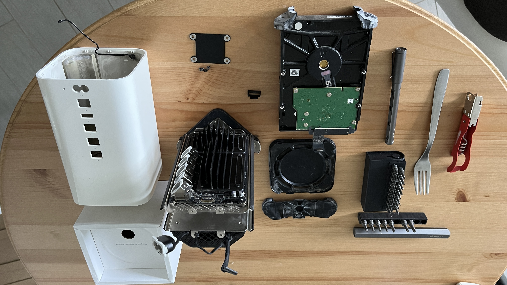

```{r, echo=FALSE}

```

I didn't thought it could last that long.
It was bouth in around year 2013.

While the access point is working just fine even before the teardown,
the harddrive does start having random failure 2 years back though nothing really went missing.
Most importantly,
I'm no longe patient with the read/write speed of such an old tech.
I don't have any HDD other than this 2TB Seagate Barracuda.
It took me _4+ hours_ to wipe out the disk before the disposal.

The _fork_?
Yep I actually use a fork to help me tear it apart.
Along with a _can opener_.

That was fun.
