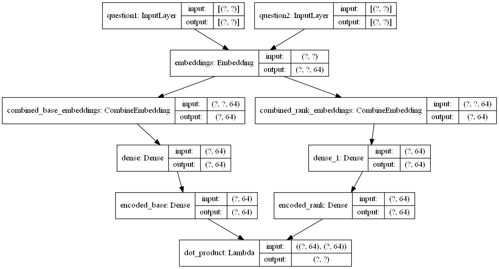

```{r meta, include=FALSE}
meta_header_file <- file("/tmp/meta_header.html")

# Add open graph meta.
meta <- c(
  '<meta name="author" content="Kyle Chung">',
  '<meta property="og:title" content="General-Purpose Ranking Models">',
  '<meta property="og:type" content="article">',
  '<meta property="og:url" content="https://everdark.github.io/k9/notebooks/ml/neural_ranking/neural_ranking.nb.html">',
  '<meta property="og:image" content="https://everdark.github.io/k9/notebooks/ml/neural_ranking/sample_ranking_net.png">',
  '<meta property="og:description" content="A data science notebook about starspace: a general-purpose neural embedding model for ranking problems.">'
)
contents <- meta

# Add Github corner.
github_corner_svg <- "../../../assets/github_corner.html"
github_corner_conf <- list(github_link="https://github.com/everdark/k9/tree/master/notebooks/ml/neural_ranking")
contents <- c(contents, stringr::str_interp(readLines(github_corner_svg), github_corner_conf))
writeLines(contents, meta_header_file)

close(meta_header_file)
```

# Background

The problem of solving "the correct ranking" is everywhere.

One inspiring example is Google's Gmail Smart-Reply feature where the user can choose from 3 machine suggested quick replies upon receiving an email.
In @henderson2017efficient the model is a ranking neural network but solving for a classification problem under the hood.

In one of its simplest format we can visualize the network model as the following graph:^[We use [`Keras`](https://keras.io/)(@chollet2015keras) to generate the plot.]



This is a text-to-text ranking network accepting two features,
both are natural language represented by bag-of-word embeddings.
Such model can also be used in conversational application that is widely adopted in lots of online platform already.

We can also easily extend the model by adding more feature dimensions (and concatenate them before feeding to the hidden layer).
Input features can take ANY form.
If it is an image we can use an Image model to do the encoding instead.

## Neural Embedding

The idea of "everything can be embedded" by neural networks is being explicitly exploited in @wu2018starspace.
In their work a framework called `StarSpace` is proposed to solve a variety of problems including but not limited to:

+ Classification
+ Multi-label classification
+ Context-aware recommender system
+ Information retrieval
+ Unsupervised word and sentence embeddings

Their framework has been open sourced and will be our main topic in this notebook.

## Other Ranking Models

For a technical discussions about other notable approaches in the literature,
readers may refer to this notebook: [Introduction to Learning-to-Rank](https://everdark.github.io/k9/notebooks/ml/learning_to_rank/learning_to_rank.html)

# Methodology Walkthrough

We will assume readers are already familiar with the foundation of learning-to-rank.
If not, feel free to visit the above-mentioned notebook first before proceeding.

## Solving Ranking as Classification

Let's go back to the Gmail Smart Reply problem first.
Given the network architecture we just layout,
how do we train the model?
What is the objective function in our learning task?

In such application our data is prepared in a pairwise manner.
For example, question-answer, email content-reply, user-item, ..., etc.
One simple yet proved to work example is to train the model with a softmax loss by batch.
That is,
we treat each batch of paired examples as a multi-classification problem to predict each pair's own class.

In training time,
a set of pseudo class labels are created for each paired example,
and the model need to learn for each base feature (or the LHS in `starspace` terminology) what is the best rank feature (the RHS) within the batch.
So for each LHS the RHS from THE OTHER paired examples will act as the negative examples for the model to learn.
This idea results in remarkably simple coding and network architecture yet is powerful enough to solve real world problems.

## Extension

In `starspace` there are two options in setting the objective function.
In their experiment for large applications a [hinge loss](https://en.wikipedia.org/wiki/Hinge_loss) is showing better performance than a softmax loss.

The logit (similarity score between a given LHS and RHS) is either a dot-product or cosine function of their encoded vectors.
In the experiment they also point out the latter is performing better in large applications.

Since we are using a classifier to solve a ranking problem,
the model's feed-forward operation won't be usable in inference time.
It will only output within-batch cross-pair logits.
But what we need is to rank against a list of candidates (RHS) given a query (LHS).
So in actual application we will need to use the model as a feature extractor rather than a real predictor.

We will see concrete examples to make this clear in our following working demo section.

Let's start coding!

# Working Demo

## Data

We use the [Quora Duplicated Question Pairs](https://www.kaggle.com/quora/question-pairs-dataset) dataset to demonstrate the modeling process.
One will need a Kaggle account to download it.
Here we use the `kaggle` API to download the data.
To install the API, run:

```sh
pip install kaggle
```

And to download the data, run:

```sh
kaggle datasets download -d quora/question-pairs-dataset -p data
```

```{r load_data, results='hide'}
library(data.table)

set.seed(777)
data <- fread("unzip -p data/question-pairs-dataset.zip")
```


```{r print_data}
head(data)
data[, .N, by=.(is_duplicate)]  # Label distribution.
```

The dataset contains paired (`is_duplicate == 1`, or positive) and also unpaired (negative) examples.
Hence it fits easily to a traditional classification model as well.
But in our use case we will pretend as if we only observed paired examples in our training data.
This is indeed quite common for a lot of applications where explicit negative examples are not prepared in the first place.
A general ranking framework will need to take care of the negative sampling process in order to optimize the desired metric.

```{r prep_data}
# Consider lower-cased characters only, for simplicity.
data[, question1:=tolower(question1)]
data[, question2:=tolower(question2)]

# Train-valid split.
is_valid <- sample(round(nrow(data) * .1))
data_train <- data[!is_valid] 
data_valid <- data[is_valid]

# Write out corpus to train a sentencepiece tokenizer latter.
if ( !file.exists("data/sentences.txt") ) {
  writeLines(c(data_train$question1, data_train$question2), con="data/sentences.txt")
}

# For training, we use only paired examples.
data_train <- data_train[is_duplicate == 1]
```

### Tokenization

We use [`sentencepiece`](https://github.com/google/sentencepiece) to learn a tokenizer on the data.
Instead of the original library,
We will use a [R wrapper](https://github.com/bnosac/sentencepiece)(@spm) for our implementation.

```{r import_spm}
library(sentencepiece)
packageVersion("sentencepiece")
```

SentencePiece is a very powerful language-agnostic tokenizer that can be trained in an unsupervised manner.
For more discussions about the underlying approach readers can refer to the notebook: [On Subword Units](https://everdark.github.io/k9/notebooks/ml/natural_language_understanding/subword_units/subword_units.nb.html).

Now let's quickly train a tokenizer particularly for the quora question dataset:

```{r train_spm}
dir.create("model", showWarnings=FALSE)
if ( !file.exists("model/sp.model") ) {
  # Note that data path must be relative to model_dir.
  sentencepiece("../data/sentences.txt", type="unigram", vocab_size=5000,
                model_prefix="sp", model_dir="model")
}
spm <- sentencepiece_load_model("model/sp.model")
```

Give it a try:

```{r demo_spm}
print(sentencepiece_encode(spm, x=data_valid$question1[2:3]))  # Tokenize as wordpiece.
sentencepiece_encode(spm, x=data_valid$question1[2:3], type="ids")  # Tokenize as token id.
```
### Pairwise Training Format

#### `starspace`

`Starspace` is a general embedding framework that supports multiple types of problems.
Here we are going to adopt one of its specific `trainMode`,
as documented in the following paragraph:

>trainMode = 3:
>
>Each example contains a collection of labels. At training time, two labels from the collection are randomly picked as the LHS and RHS.
>
>Use case: learn pairwise similarity from collections of similar objects, e.g. sentence similiarity.

Here a "label" is represented by a set of discrete features,
in our case it is bag-of-words for a given question.
Each word is space-separated and each label (question) is tab-separated.^[In their document the term "label" is a loose term. For example in the [SentenceSpace section](https://github.com/facebookresearch/StarSpace#sentencespace-learning-sentence-embeddings) it is mentioned that from one example of multiple collections two are randomly picked up and "one as the input and one as the label."]

Note that for English (or other space-separated languages) training data it is possible to skip the tokenization phase and directly put the raw text in training a StarSpace model.
But here we choose a more general approach by explicitly tokenize the language features beforehand.
Such workflow will be applicable to whatever natural languages facing us.

To prepare the required input format should we use the `StarSpace` C++ library directly,
we can simply concatenate all the parsed tokens and write them to disk:

```{r format_input}
to_file <- function(DT, outfile) {
  # Use a binary file connection to make sure \r is not written out on Windows.
  # That is, we strictly require unix style EOL.
  # This is essential as starspace model seems to be confused by \r character
  # and hence the resulting learned vocabulary will be contaminated.
  f <- file(outfile, open="wb")
  on.exit(close(f))
  q1 <- sentencepiece_encode(spm, x=DT$question1)
  q2 <- sentencepiece_encode(spm, x=DT$question2)
  q1 <- sapply(q1, paste, collapse=" ")
  q2 <- sapply(q2, paste, collapse=" ")
  sent_space <- paste(q1, q2, sep="\t")
  writeLines(sent_space, con=f, sep="\n", useBytes=TRUE)
}

if ( !file.exists("data/ss_train.txt") ) {
  to_file(data_train, "data/ss_train.txt")
}

# Take a look at a single example.
print(readLines("data/ss_train.txt", n=1, encoding="UTF-8"))
```
If we have multiple sentences (more than 2) we can just append them with tab as delimiter.
Here for one example we always have exactly two sentences (questions).

#### `ruimtehol`

Instead we can use another R wrapper package `ruimtehol`(@ruimtehol) to do the training.

```{r import_ruimtehol}
library(ruimtehol)
packageVersion("ruimtehol")
```

Rather than the original input format,
`ruimtehol` expects a long format with 1 token per row.
We can use the convenience function `unnest_tokens` from package [`tidytext`](https://github.com/juliasilge/tidytext)(@tidytext) to manipulate text data in tabular form:

```{r format_long_input}
q1t <- tidytext::unnest_tokens(
  data_train[, .(id, qid1, question1)],
  input="question1", output="token",
  token=function(x) sentencepiece_encode(spm, x))
q2t <- tidytext::unnest_tokens(
  data_train[, .(id, qid2, question2)],
  input="question2", output="token",
  token=function(x) sentencepiece_encode(spm, x))
sent_space_long <- rbindlist(list(q1t, q2t), use.names=FALSE)

# Rename to match API requirement.
setnames(sent_space_long, c("doc_id", "sentence_id", "token"))

# Take a look.
head(sent_space_long)  # Unicode char won't show properly on Windows.
```

Note that `<U+2581>` is just the special prefix used in `sentencepiece` to represent white space and also dummy sentence beginning, so we can distinguish between a subword and a full word.

## Model Training and Prediction

### `starspace`

The command line to train a baseline model could be something like:

```bash
starspace train \
    -trainFile data/ss_train.txt \
    -model model/ss.model \
    -trainMode 3 \
    -fileFormat labelDoc \
    -dim 64 \
    -verbose 1
```

After training,
we can read back the resulting embeddings:

```{r read_embedding}
embeddings <- fread("model/ss.model.tsv", quote="", encoding="UTF-8")
dim(embeddings[,-1])  # vocab size * embedding size
```
One may realize that the resulting vocabulary dimension is larger than our specified `vocab_size` in our tokenizer.
The most possible reason is because we encode the original text into word pieces instead of vocabulary id,
so the unknown vocabulary (out of `vocab_size`) will remain.
For example,
here is one question that can be found in the dataset involving an unknown word "改善" (it means improving and is originated from Japanese but also used in Mandarin for the same meaning).
If we parse it as tokens any unknown word remain.
But if we parse it as ids all unknowns become the unknown id which by default is 0.

```{r parse_unknown}
s <- "what is kaizen (改善)?"
print(sentencepiece_encode(spm, s)[[1]])
sentencepiece_encode(spm, s, type="ids")[[1]]
```
Let's verify this by comparing the vocabulary difference between our `sentencepiece` model and `starspace` one:

```{r diff_vocab}
v1 <- fread("model/sp.vocab", quote="", encoding="UTF-8")$V1
v2 <- embeddings$V1

# Show unknown words:
unk_words <- setdiff(v2, v1)
print(unk_words)
```

```{r check_unk}
table(unlist(sentencepiece_encode(spm, unk_words, type="ids")))
```
As we can see,
there are only two IDs revealed after parsing.
`0` is unknown and `49` is just the special prefix `r v1[49+1]`.

To workaround this issue we can pass instead the token id into the `starspace` model.
However by doing so we will need some extra engineering effort to convert the model output into human readable form,
by calling `sentencepiece` to decode the returned id sequence.
For simplicity we will keep it as is for now.

#### Ranking Prediction

Let's examine how good our baseline model is,
by finding the most similar questions among all the `question2` in our validation set for the first 3 `question1` in the same dataset.

To use the prediction interface,
we need to provide a set of `basedoc` as ranking candidates:

```{r test_prediction}
# Take 3 examples for testing.
to_file(data_valid[is_duplicate == 1][1:3], "data/test_sentences.txt")

# Use all questions in question2 as the ranking candidates.
q2 <- sentencepiece_encode(spm, x=unique(data_valid$question2))
q2 <- sapply(q2, paste, collapse=" ")
writeLines(q2, con="data/rank_sentences.txt", useBytes=TRUE)
```

Now we run the test interface in `starspace`:

```sh
starspace test \
    -testFile data/test_sentences.txt \
    -model model/ss.model \
    -trainMode 3 \
    -basedoc data/rank_sentences.txt \
    -predictionFile data/predictions.txt \
    -K 10 \
    -fileFormat labelDoc
```

The results:

```{r show_prediction, comment=''}
cat(readLines("data/predictions.txt", encoding="UTF-8"), sep="\n")
```

The model works pretty well indeed.

Though the result only consider the *exact* RHS sentence to be the correct answer (prefix by a `(++)`),
in our dataset since there are usually more than 1 duplicated questions for each given question,
we found that those ranked as highly similar are really OTHER duplicates in the dataset.

Of course our model didn't directly apply to the original problem,
where we need to give a binary answer on any given question pair.
But we can definitely use the learned embeddings to train another downstream model for this.
In such a downstream model since our learned embeddings are already context-aware (they are derived from a learning task optimizing pairwise similarity),
the result should be better than a model using other pre-trained word embeddings.

### `ruimtehol`

Now let's also demonstrate how we can run `starspace` through `ruimtehol`,
its R wrapper:^[Note that the wrapping version of `starspace` in `ruimtehol` may not be the up-to-date version available in `starspace`'s original repository.]

```{r run_ruimtehol}
if ( !file.exists("model/ruimtehol.model") ) {
  ss_model <- embed_sentencespace(sent_space_long, 
                                  model="model/ruimtehol.model")
  # The call doesn't seem to write the model file as suggested by the document.
  # Save it explicitly instead.
  starspace_save_model(ss_model, file="model/ruimtehol.model")
} else {
  ss_model <- starspace_load_model("model/ruimtehol.model")
}
```

Indeed this function will end up converting the long format into the StarSpace format we just prepared before,
then call the `starspace` binary.
There are quite some overheads in this process before the training job begins.^[Indeed our pre-processing code without the need to prepare the long-format will run considerably faster than `ruimtehol`, because we take the advantage of knowing there are always 2 questions in 1 document in this particular dataset.]

There is one more difference other than input format preparation between the original `starspace` and the R wrapper `ruimtehol::embed_sentencespace`.
The latter comes with a parameter `early_stopping` which will set aside additional validation set to implement early stopping,
which is quite a convenient feature.
By default it is set to 0.75 so even though we didn't specify a validation set in the verbose output one can see the validation score on the random 25% of the training examples.

To bypass the pre-processing overhead,
we can instead use the low-level API:

```r
ss_model <- starspace(model="model/ruimtehol.model",
                      file="data/ss_train.txt",
                      fileFormat="labelDoc",
                      trainMode=3,
                      dim=64)
```

This time let's get some sentence embeddings and calculate the similarity on our own:

```{r embed_sent}
# Get one LHS sentence.
q1 <- paste(sentencepiece_encode(
  spm, x=data_valid[is_duplicate == 1]$question1[1])[[1]], collapse=" ")
LHS <- starspace_embedding(ss_model, x=q1)

# Extract the embeddings for the first 100 sentences.
RHS <- starspace_embedding(ss_model, x=q2[1:100])

# Do pairwise cosine similarity.
res <- embedding_similarity(LHS, RHS, top_n=5)
setDT(res)

res[, .(term2, similarity, rank)]
```

One final remark:
On Windows system using `ruimtehol` may encounter some encoding issues which make the model less effective (since the vocab becomes a little bit noisier).

`Starspace` also come with a Python wrapper officially but the work seems to be only partially done.
We leave the exploration for the readers.

# References
